# サンプルアプリケーションの起動

## ①. サンプルアプリケーションの入手
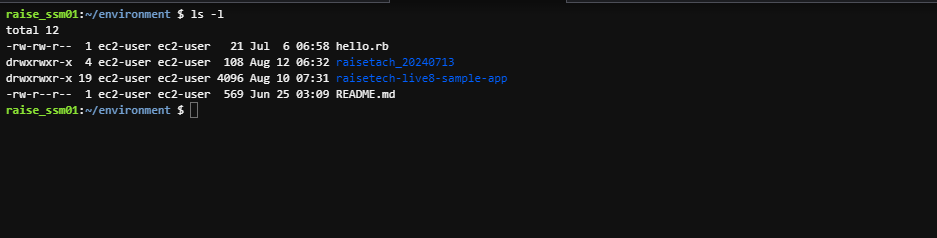
## ②. 添付されている README.md の理解
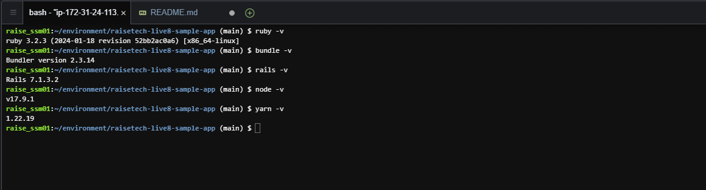
## ③. デプロイ作業
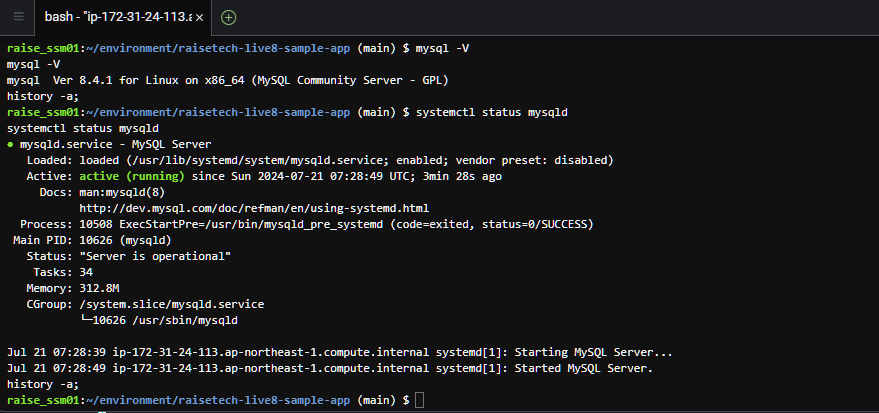
## ⑤. Webブラウザでの起動確認
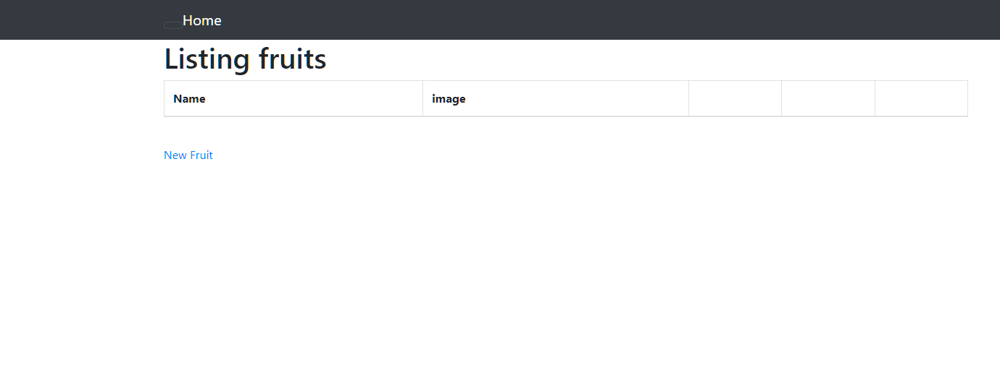
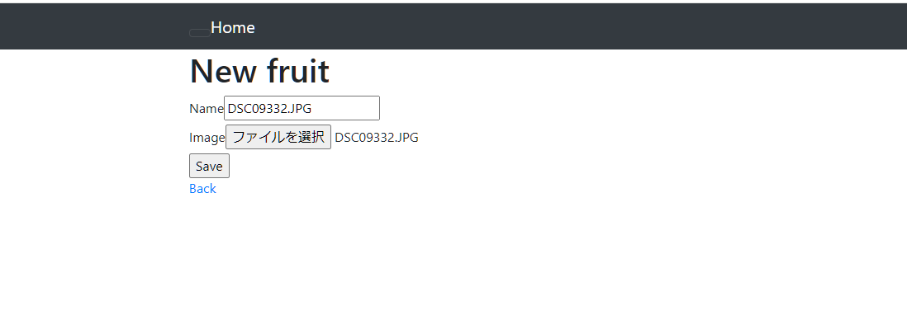
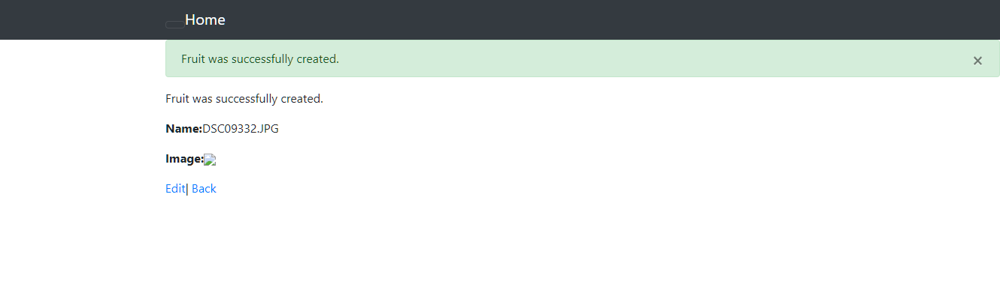
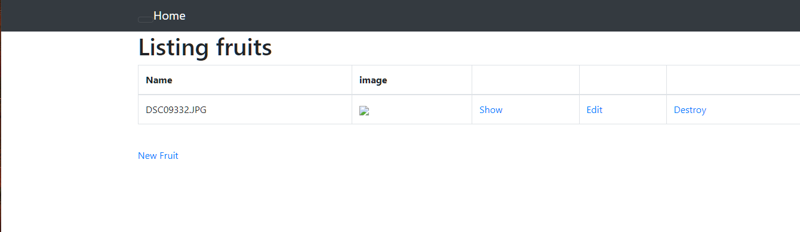

## 1. APサーバについて調べる
### ・APサーバの名前とバージョンの確認
RailsのAPサーバはPumaです。バージョンは 6.4.2です。
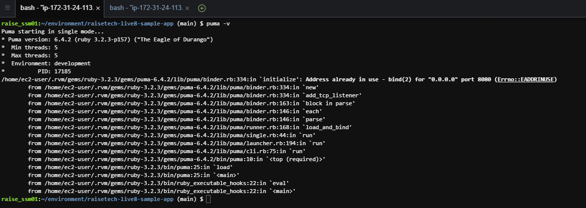

### ・APサーバを終了させた場合、引き続きアクセス可能か
APサーバを終了させた場合は、APにアクセスできません
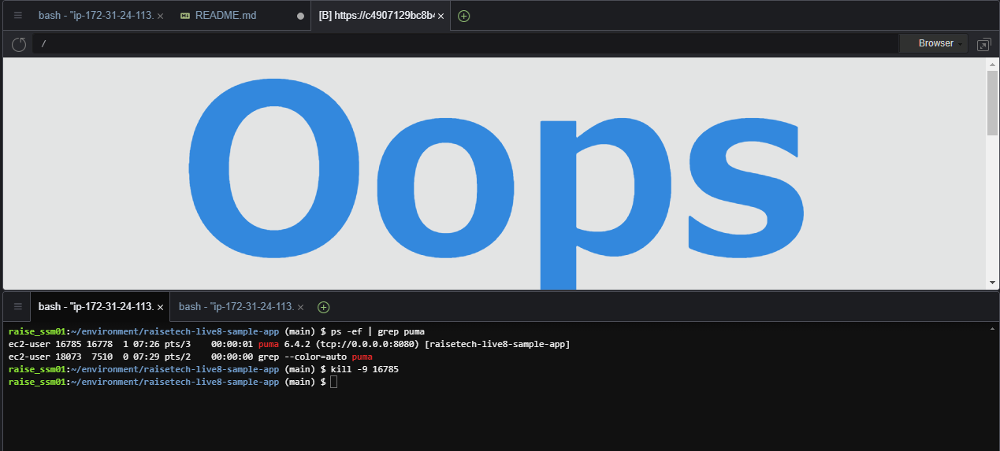
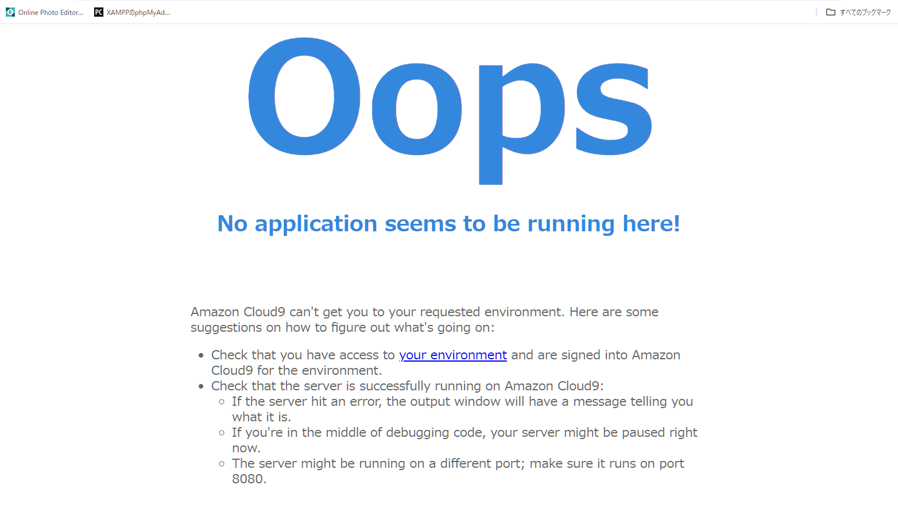

## 2. DBサーバについて調べる

### . サンプルアプリケーションを使ったDBサーバ(DBエンジン)の名前と、今Cloud9で動作しているバージョンの確認
DBエンジン名：mysql  DBエンジンのバージョン：8.4.2
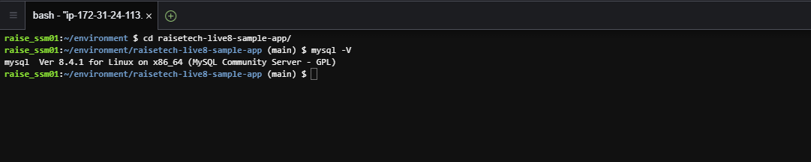

### ・DBサーバを終了させた場合、引き続きアクセス可能か
DBサーバを終了させた場合は、DBサーバからのエラーメッセージが表示されるので、APにアクセスできません。
以下のコマンドを投入してDBサービスを停止
sudo systemctl stop mysqld
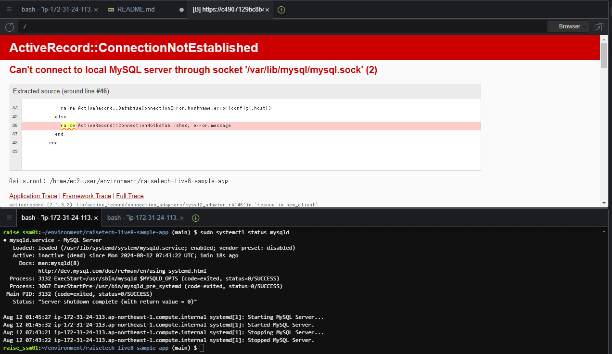

### ・Railsの構成管理ツールの名前
Railsの構成管理ツールの名前はBundlerです。gemのバージョンやgemの依存関係を管理が可能。bundlerを使うことで、gemのバージョンを一致させることができます。複数人の開発環境であった場合に、同じgemに統一したり、開発するシステムに合わせてgemのバージョンを切り替える、といったことが可能です。

## 3. 今回の課題で学んだこと、感じたこと
・課題の作成にかなり時間をかけてしまいました。2週間程度の日数を費やしています。
・APサーバについて調べるでは、APサーバを停止させるという課題で、プロセスを停止することをなかなか思いつかなくて時間がかかってしまいました。
・Markdownの画像埋め込み方法とgithubにアップデートする順番などに時間を費やしてしまいました。
・仕事と同じように納期があることを意識し、調べる時間に制限をつけてなるべく早く課題を終了させる、質問をするように心がけたいと思います。