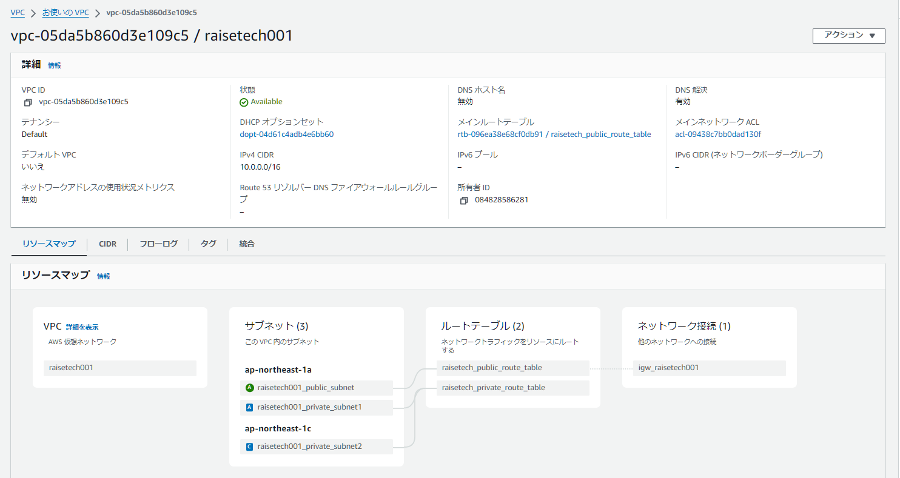
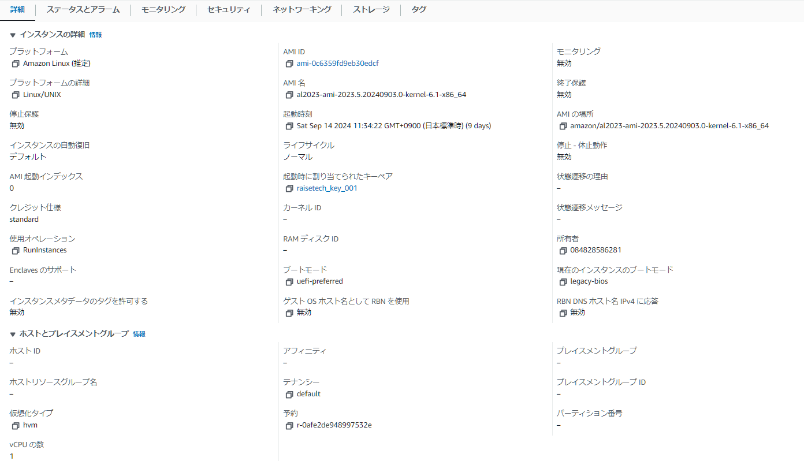
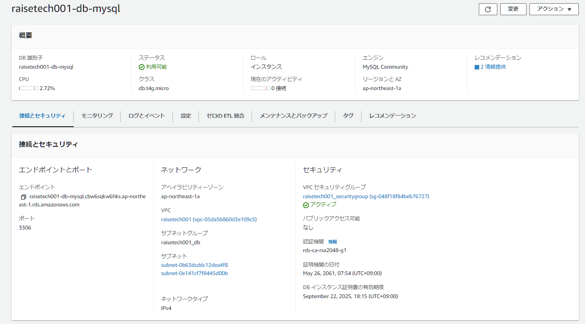
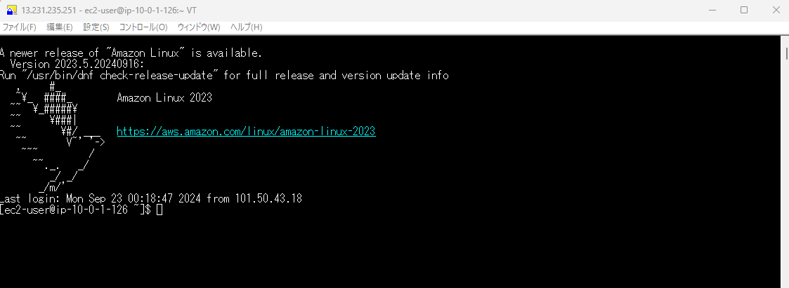

# 第4回目課題
## ①. AWS上に新しくVPCを作成

## ②. EC2の構築

## ③. RDSの構築

## ④. EC2への接続

## ⑤. EC2からRDSへの接続

## ⑥. EC2のセキュリティグループ

## ⑦. RDSのセキュリティーグループ

## 今回の課題で学んだこと、感じたこと
VPCの作成については、既存のVPCにサブネットの設定をしてしまい、EC2の作成とRDSの作成を含め約1カ月以上時間を費やすことになりました。AWSの無料期間が過ぎてしまったので、新しく家族の枠でAWSのアカウントを作成しました。以降の課題もこちらで行います。
今回の課題で作成したEC2でgithubに課題の画像などをPushしております。以降もこのEC2で行うようにします。
サブネットやセキュリティーグループ、ゲートウェイの設定などネットワーク設定で時間を費やすことになりましたが、自身で調べて納得しているので今後役に立つと思っています。
