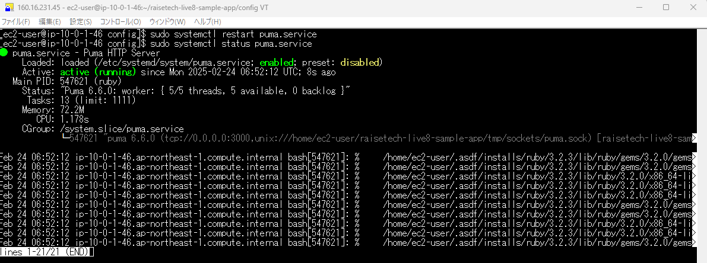
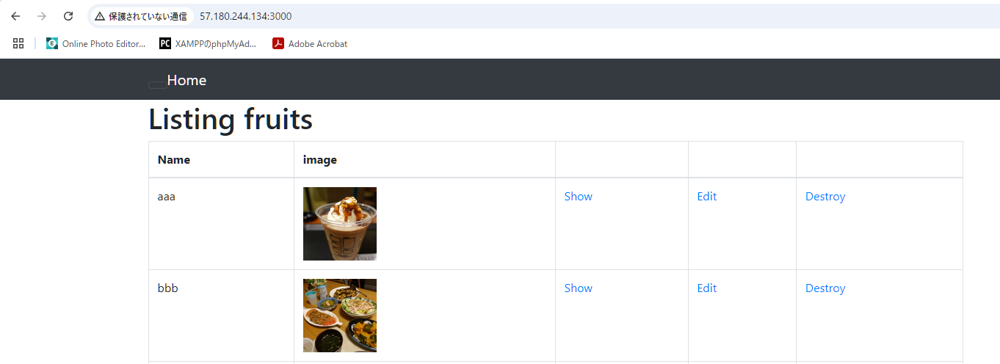
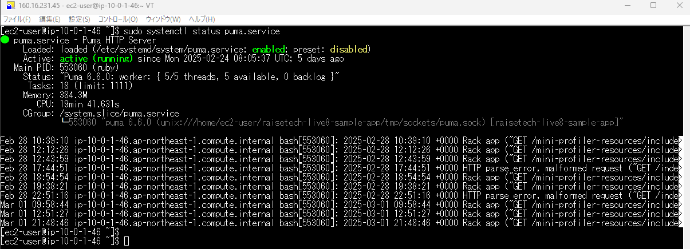
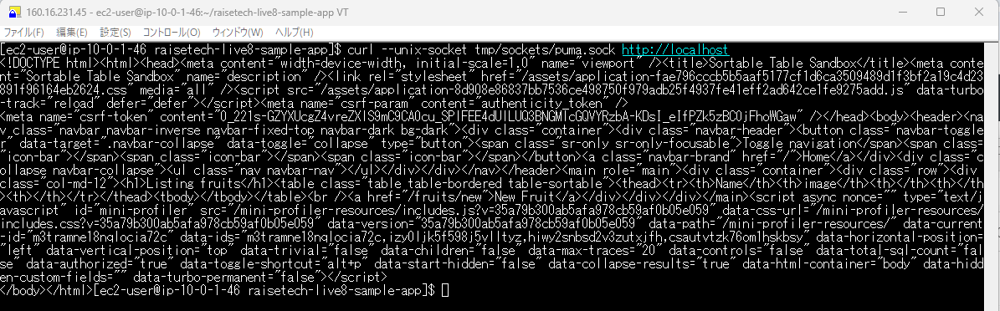
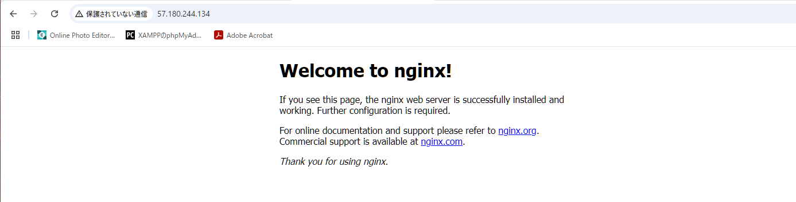
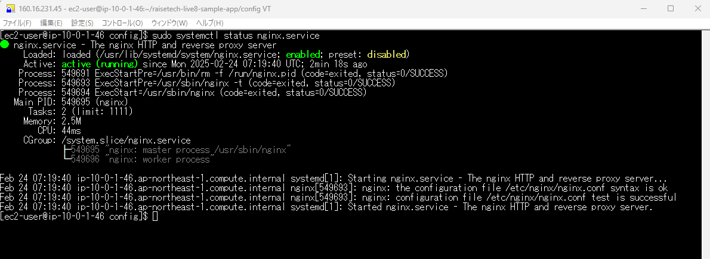
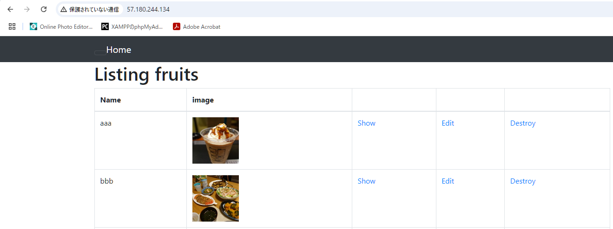
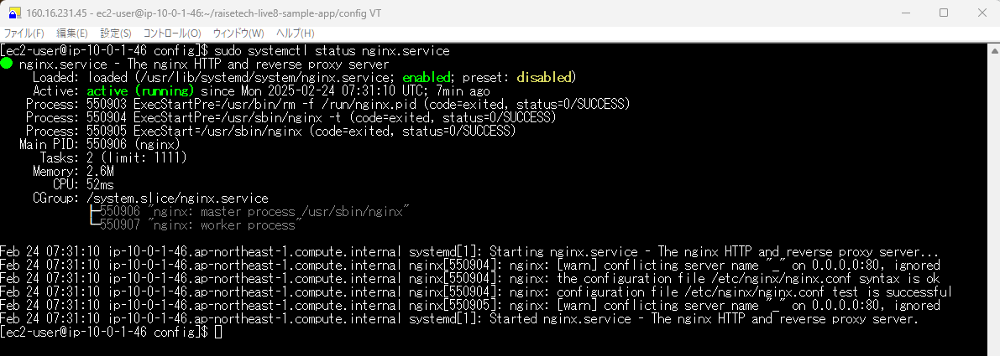
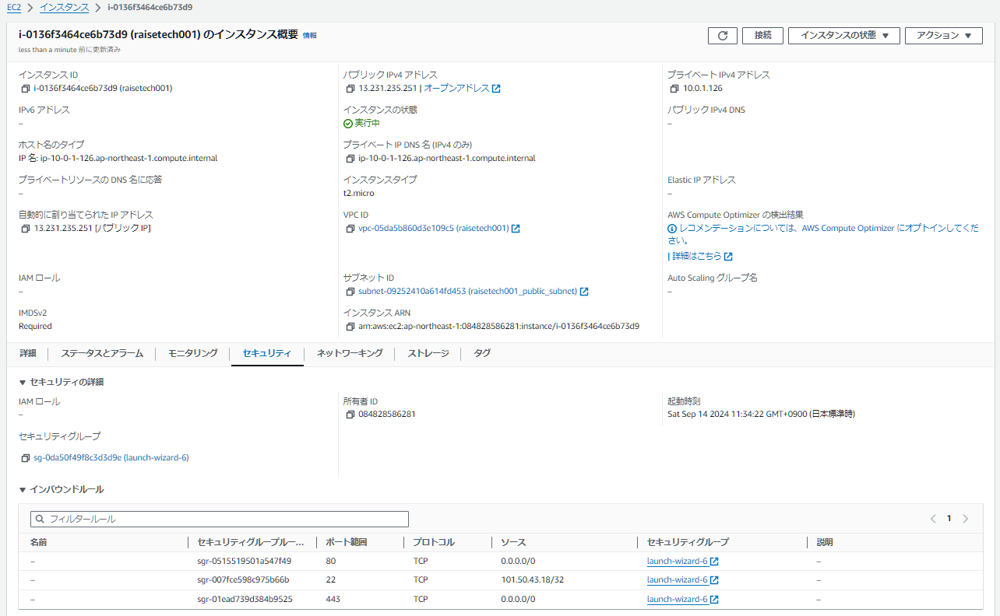
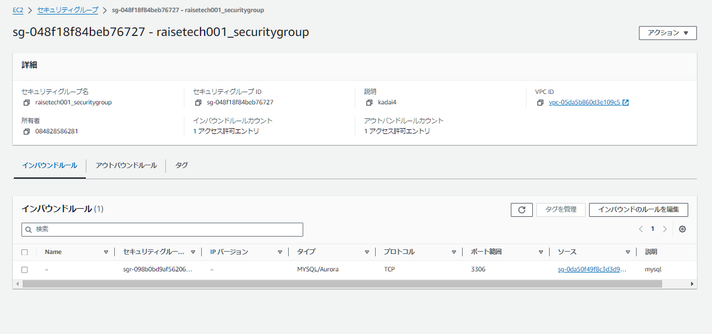

# 第5回目課題
## ①. 組み込みサーバ（Puma）でのRailsアプリケーション動作確認  
- PumaサービスのCLIコマンドでの確認
  
- PumaサービスのWebブラウザでの動作確認

## ②. 組込みサーバとUnix Socketを使ったRailsアプリの動作確認
- 組込みサーバとUnix Socketを使ったRailsアプリのCLIコマンドでの確認
  
- PumaサービスをUnix Socketにcurlにてリクエストを送信

## ③. Nginxの単体起動確認
- Nginxサービスの単体での起動をWebブラウザで確認
  
- NginxサービスCLIコマンドでの確認

## ④. Nginxと組込みサーバ、Unix Socketを組み合わせてのRailsアプリケーション動作確認
- Nginxと組込みサーバ、Unix Socketを組み合わせてのRailsアプリケーションをブラウザで確認
  
- Nginxと組込みサーバ、Unix Socketを組み合わせてのRailsアプリケーションをCILコマンドで確認
  

## ⑤. ALBでの設定と接続確認

## ⑥. EC2のセキュリティルール

## ⑦. RDSのセキュリティールール

## 今回の課題で学んだこと、感じたこと
VPCの作成については、既存のVPCにサブネットの設定をしてしまい、EC2の作成とRDSの作成を含め約1カ月以上時間を費やすことになりました。AWSの無料期間が過ぎてしまったので、新しく家族の枠でAWSのアカウントを作成しました。以降の課題もこちらで行います。
今回の課題で作成したEC2でgithubに課題の画像などをPushしております。以降もこのEC2で行うようにします。
サブネットやセキュリティーグループ、ゲートウェイの設定などネットワーク設定で時間を費やすことになりましたが、自身で調べて納得しているので今後役に立つと思っています。