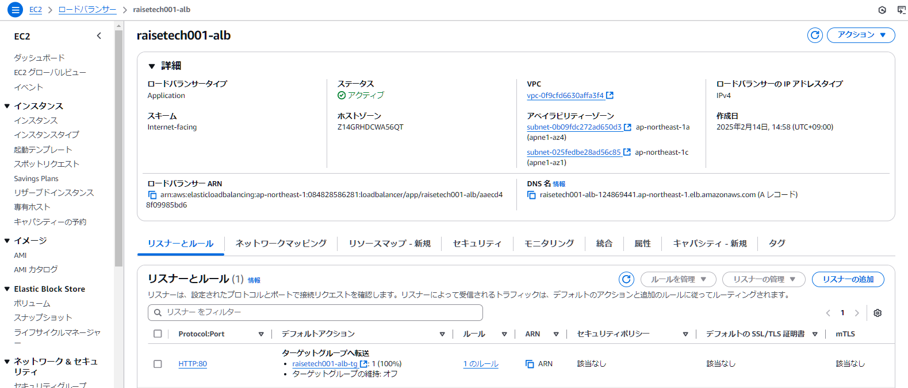
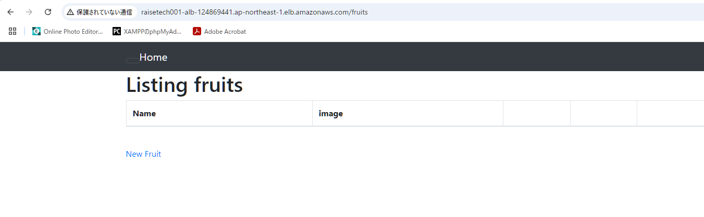
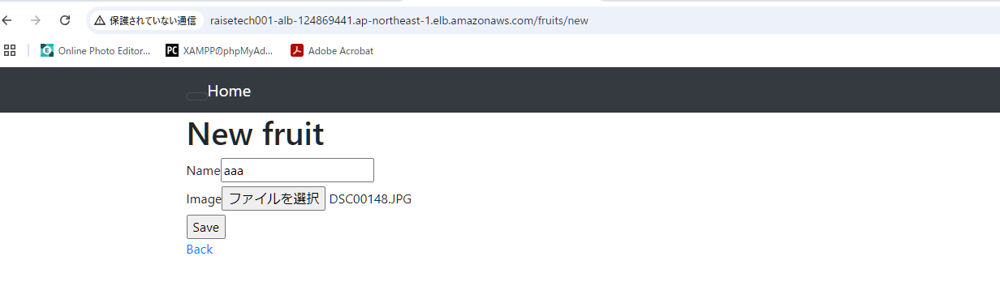
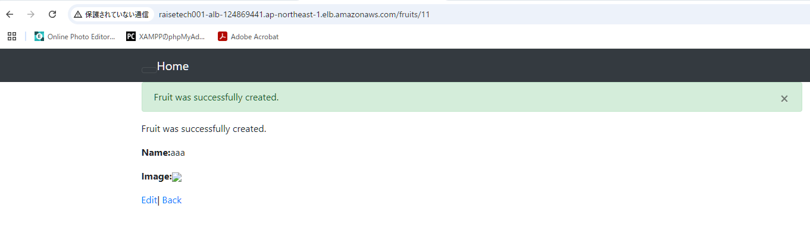
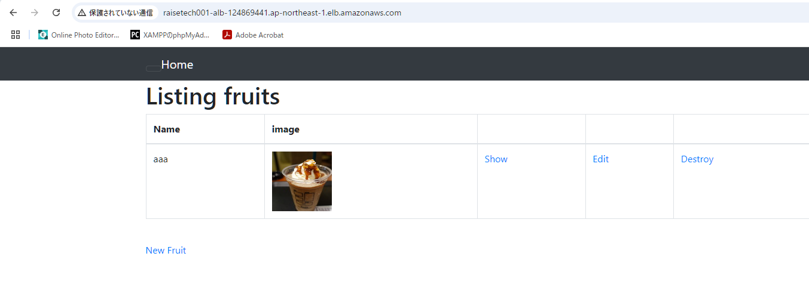
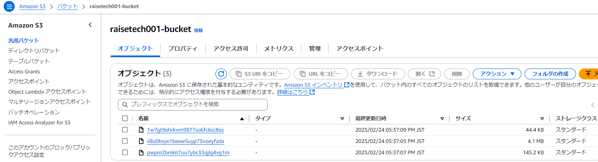
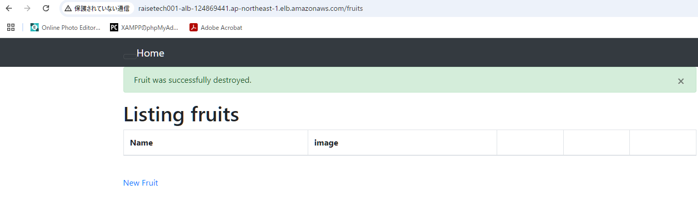
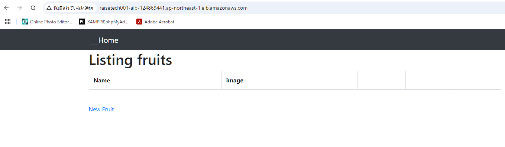
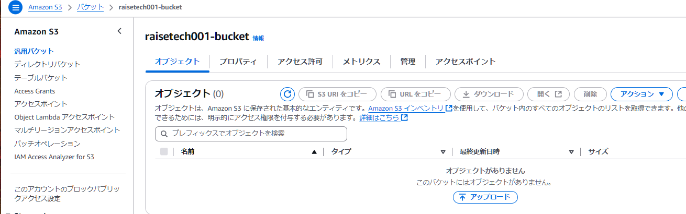
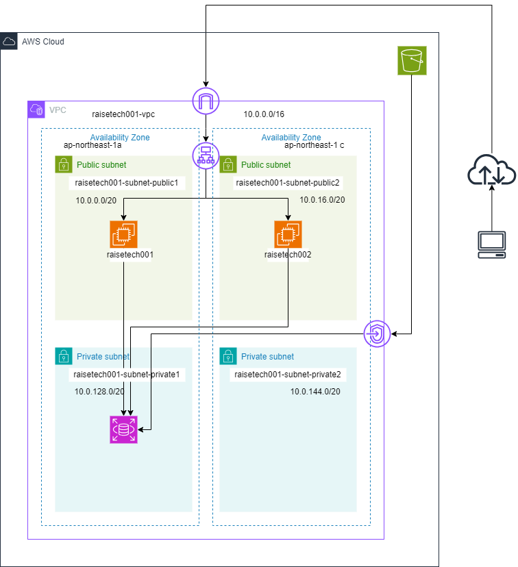

# 第5回目課題
## ①. 組み込みサーバ（Puma）でのRailsアプリケーション動作確認  
- PumaサービスのCLIコマンドでの確認
  
- PumaサービスのWebブラウザでの動作確認

## ②. 組込みサーバとUnix Socketを使ったRailsアプリの動作確認
- 組込みサーバとUnix Socketを使ったRailsアプリのCLIコマンドでの確認
  
- PumaサービスをUnix Socketにcurlにてリクエストを送信

## ③. Nginxの単体起動確認
- Nginxサービスの単体での起動をWebブラウザで確認
  
- NginxサービスCLIコマンドでの確認

## ④. Nginxと組込みサーバ、Unix Socketを組み合わせてのRailsアプリケーション動作確認
- Nginxと組込みサーバ、Unix Socketを組み合わせてのRailsアプリケーションをブラウザで確認
  
- Nginxと組込みサーバ、Unix Socketを組み合わせてのRailsアプリケーションをCILコマンドで確認
  

## ⑤. ALBでの設定と接続確認
- ALBの設定

- ブラウザにてALBのDNS名にアクセスしてRailsアプリケーションが表示できるか確認

## ⑥. S3の追加と設定
- Railsアプリで画像ファイルを追加する(aaaという名前で追加)

- 画像ファイルの追加に成功

- aaaという名前の画像ファイルが追加されたことを確認

- Railsアプリで画像ファイル追加後にS3バケットを確認する

- Railsアプリで画像ファイルを削除する

- ブラウザで削除した画像ファイルが無いことを確認

- Railsアプリで画像ファイルを削除後にS3バケットを確認する

## ⑦. 構造図

## 今回の課題で学んだこと、感じたこと
今回の課題では、前回(4回)AWSのアカウントでEC2を作りましたが、アプリの動作で画像ファイルを保存したものを表示ができなかった点を修正する箇所で時間を費やしてしまいました。また課題に取り組んでいる最中にいろいろな出来事があり、一旦講座を聞くのみとなってしまい。4カ月以上も何も出来ない時期がありました。ALB設定はそれほど時間を費やすことはありませんでしたが、セキュリティーグループをEC2に紐づける設定など難易度が高く感じられました。AWSの構造図を記載では、矢印の作成に手間取りました。構成図作成にはテクニックや慣れが必要かと感じました。
