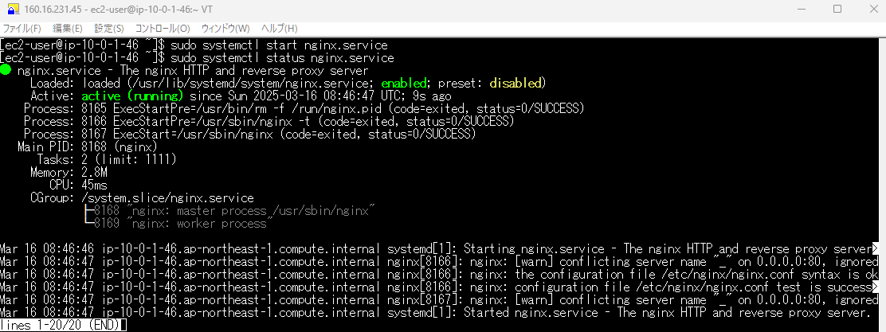
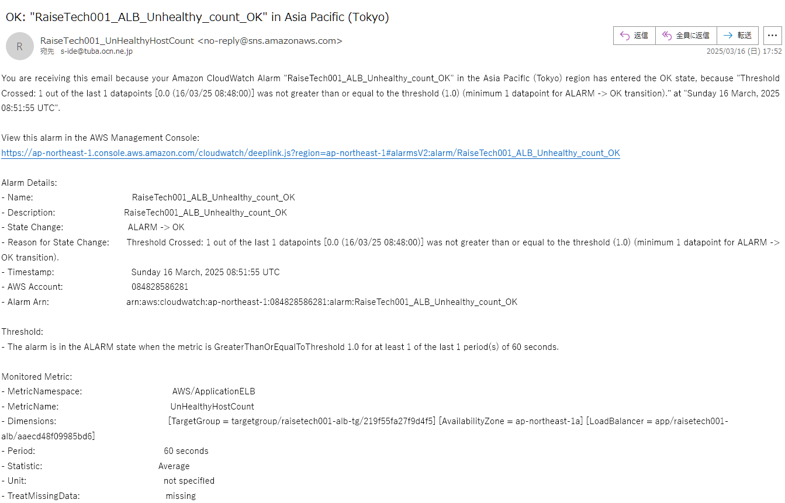

# 第6回目課題
## ①. 最後にAWSを利用した日の記録をCloudTrailのイベントから探し出す
- CloudTrailのイベント履歴から自身のIAMユーザで最後に利用したイベント(にS3バケットを削除した)を確認
  - イベント名：DeleteBucket
  

## ②. CloudWatchアラームを使って、ALBのアラームを設定し、メール通知する
- CloudWatchアラームのALBアラームとアクションの設定
  - ALBのターゲットグループが「異常」を監視するアラームを設定
  
  - ALBのターゲットグループが「異常」であればアラートメールを送信するアクションをSNSに設定
  
  - ALBのターゲットグループが「正常」に戻ったことを監視するアラームを設定
  
  - ALBのターゲットグループが「正常」に戻ったことを知らせるアラートメールを送信するアクションをSNSに設定
  
- Railsアプリケーションを使えない状態にしてアラームが通知されるかを確認
  - nginxサービスを停止状態にする
  
  - ALBでターゲットグループがヘルスチェックがUnhealthyを確認
  
  - アラームメールの通知を確認
  
  - nginxサービスをリスタートして稼働させる
  
  - ALBでターゲットグループがヘルスチェックがHealthyに戻っていることを確認
  
  - アラーム復旧メールの通知を確認

## ③. AWS利用料の見積を作成する
[AWS利用料の見積り]https://calculator.aws/#/estimate?id=ce776c078ee4e17b7cda0a1bfa7d95356bd19c28

## ④. 今月までのAWSの料金
- 現在 2025年3月18日時点での利用料
  

- ECSの料金
  

- VPCの料金
  

## 考察
- 第5回の課題に時間がかかり、その間マシンを停止しなかったため無料分の750時間を超えてしまっているので、通常の費用がかかっています。またロードバランサ確認のためマシンを２台作成しています。
- VPCのパブリックIPアドレスの使用に費用が掛かることに気づいていませんでした。構築での予算配分などまだまだ勉強が必要と感じました。

